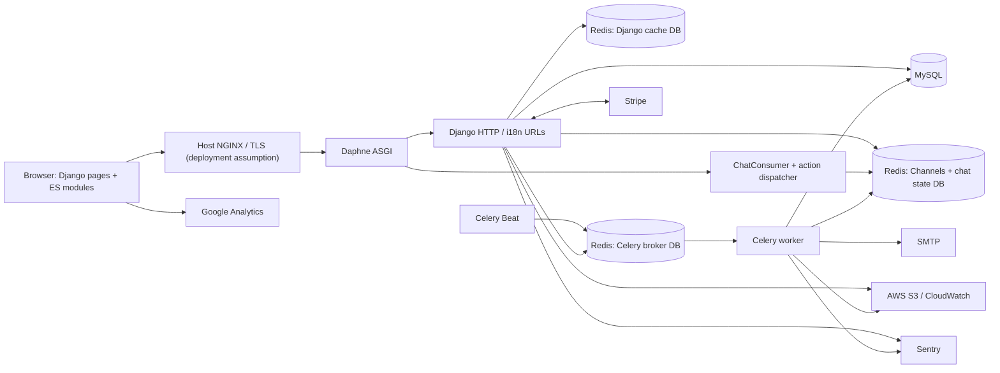
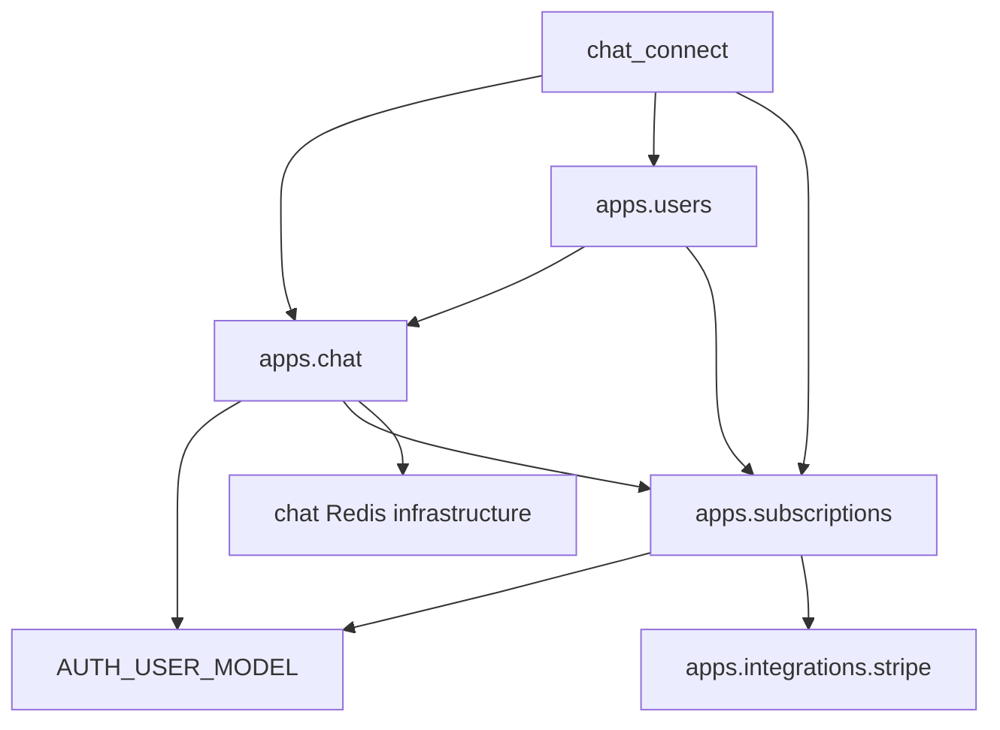

# Architecture and Codebase

> Last analyzed commit: `225c22d13f051a73ffa16efe91fbf1eb0ba2829b` on branch `003-user-pro`  
> Analysis date: 2026-08-02

## High-level architecture

This is a server-rendered Django monolith with three domain apps, an ES-module browser chat client, an ASGI real-time path, and Celery workers. HTTP and WebSocket traffic share the Daphne ASGI process in production. MySQL stores durable entities; one Redis server is partitioned into logical databases for cache, Channels/application chat state, and Celery. There is no REST API or separate frontend build application.

### Main processes

| Process | Implementation | Responsibility |
|---|---|---|
| Development web | Django `runserver` from `deployments/development/Dockerfile` | HTTP plus ASGI development handling and browser reload |
| Production web | Daphne command in `deployments/production/Dockerfile` | Serves `chat_connect.asgi:application` on port 8000 |
| Celery worker | `celery -A chat_connect worker` in both Compose files | Invoice/cancellation emails and periodic bot task execution |
| Celery Beat | `celery -A chat_connect beat` | Enqueues `apps.chat.tasks.send_random_messages_tick` |
| MySQL | `db` service | Durable Django models |
| Redis | `my-redis` service | Cache, Channels/chat state, Celery broker; logical DB indices come from environment |
| Frontend build/watch | Dart Sass scripts in `package.json` | Watches SCSS and produces expanded/minified CSS and maps |

## Repository structure

| Path | Responsibility / important contents | Safe to modify? | Related context |
|---|---|---|---|
| `apps/chat/` | HTTP chat pages, WebSocket consumer/protocol, Redis adapters, bot models/services/tasks, S3 topic import, browser client | Yes, preserving dispatcher/service split and protocol compatibility | `03`, `04`, `05` |
| `apps/users/` | Custom `AbstractUser`, profile, signup/login/logout, account creation, S3 user import | Yes; auth/admin and cross-app subscription dependency require care | `01`, `03`, `04` |
| `apps/subscriptions/` | Subscription/event/notification models, lifecycle services, webhooks, emails/tasks, billing views | Yes; preserve locks, current-subscription rule, and idempotency | `03`, `04`, `05` |
| `apps/integrations/stripe/` | Thin Stripe SDK adapters and event constants | Yes; keep provider objects out of domain views/services where adapters exist | `05` |
| `chat_connect/settings/` | Shared and environment-specific Django configuration | Yes; shared values in `chat_connect/settings/base.py`, overrides in named environment modules | `05`, `06` |
| `chat_connect/templates/` | Base/navigation, landing/content pages, auth templates | Yes; public legal claims and i18n need review; one auth template is currently invalid | `04`, `07` |
| `chat_connect/static/` | Shared JS, SCSS sources, generated CSS/maps, images/fonts | Edit SCSS/JS sources; regenerate CSS/maps | `06` |
| `deployments/` | Development, test, and production images | Yes with deployment verification | `06`, `07` |
| `.github/` | CI setup, chat-only test/coverage jobs, deployment by SSH | Yes with least-privilege care | `06`, `07` |
| `docker-compose.dev.yml`, `docker-compose.prod.yml` | Local/full-stack and VPS service wiring | Yes; validate all required environment variables and service names | `06` |
| `Pipfile`, `Pipfile.lock`, `requirements.txt` | Development/locked dependency source and production image dependency list | Edit `Pipfile`/requirements intentionally; regenerate lock | `06`, `07` |
| `package.json`, `package-lock.json` | Sass-only Node toolchain | Edit package source; regenerate lock | `06` |
| `docs/ai-context/` | Persistent AI source material | Yes; keep evidence and commit field current | all |
| Migrations / generated CSS / caches / collected static | Schema history or generated output | Do not hand-edit unless intentionally authoring an exceptional migration | `03`, `06` |

## Application and module map

### `apps.chat`

- **Models:** `Topic`, `ConversationFlow`; both feed automated messages, not user history.
- **HTTP:** `HomeChatView`, `ChatView`, static content routes, sitemap.
- **Real-time:** `ChatConsumer` owns per-connection `groups` and `private_chats`; `websocket/dispatch.py` routes protocol actions to `services/actions/`.
- **Services:** presence, registration, private-chat restoration, Pro lookup, bot cache loading and selection.
- **Infrastructure:** sync/async Redis wrappers use `settings.REDIS_CHANNEL_LAYER_URL`; `BotMessageRedisStore` owns bot key formats.
- **Tasks:** one periodic bot task; Beat schedule is configured in settings.
- **Tests:** views, action handlers, Redis store, bot services, presence, broadcast helpers. Actual consumer helper methods are prefixed `_test_` and therefore not discovered.
- **Dependencies:** Django user model, `apps.subscriptions.models.UserSubscription`, Channels, Redis, Celery, boto3.
- **Public interfaces:** URL names under `chat:`, `/ws/chat/`, four inbound actions, broadcast helper/service functions.

### `apps.users`

- **Models:** custom `User(AbstractUser)` and one-to-one `Profile`.
- **Manager/service:** `CustomUserManager.create_user_with_profile`; transactional signup service also ensures `UserSubscription`.
- **Views:** signup with normal/Pro intent, session login plus Redis registration, logout plus Redis/cookie cleanup.
- **Tests:** only logout behavior and factories. Signup, login, form uniqueness, service atomicity, and custom admin behavior have no direct tests.
- **Dependencies:** imports subscription status in `User` properties and creates `UserSubscription` during signup; imports chat Redis services in views/command.
- **Public interfaces:** `/accounts/` routes, `User.is_pro`, `User.needs_payment_configuration`, `create_user_account_from_signup_form`.

### `apps.subscriptions`

- **Models:** `UserSubscription`, `StripeWebhookEvent`, `StripeInvoiceNotification`; status enums under `models/choices/`.
- **Views:** Checkout creation/result/cancel page, detail, cancellation, Billing Portal, non-localized Stripe webhook.
- **Services:** Checkout setup, state transition/query functions, webhook claim orchestration, invoice notification queuing.
- **Webhook handlers:** registry plus checkout/invoice/subscription handlers and Stripe-object-to-DTO mappers.
- **Tasks/emails:** retrying invoice and cancellation email tasks; HTML/text mail composition.
- **Tests:** extensive lifecycle/mapping/email/cancellation tests. Checkout/Billing Portal/detail/webhook views, task execution, and active webhook orchestration are weak or absent.
- **Dependencies:** custom user model, Stripe adapters, Celery, SMTP.
- **Public interfaces:** `UserSubscription.pro`, lifecycle service functions, webhook registry, URL names under `subscriptions:`.

### `apps.integrations.stripe`

- Creates a cached `StripeClient` configured with secret key, pinned API version, and two SDK network retries.
- Wraps customer Checkout, Checkout retrieval, Billing Portal, subscription retrieval/cancellation, invoice field extraction, timestamp conversion, and webhook verification.
- Has no tests in its own package; most calls are mocked by subscription tests.

## Architectural patterns

| Pattern | Evidence | Notes |
|---|---|---|
| Django apps | `apps/chat`, `apps/users`, `apps/subscriptions` | Clear feature boundaries, but users and subscriptions depend on one another. |
| Service layer | `apps/*/services/` | Strongest in subscription state changes and chat actions; simple queries sometimes remain in views. |
| Provider adapter | `apps/integrations/stripe/` | Keeps Stripe SDK syntax isolated, including customer creation via `customers.create_customer`. |
| DTO mapping | `apps/subscriptions/webhook_handlers/dtos.py`, `apps/subscriptions/webhook_handlers/mappers.py` | Provider payloads are converted before domain mutation. |
| Action dispatcher | `apps/chat/websocket/dispatch.py::ACTION_MAP` | Consumer transport delegates behavior to async handlers. |
| Infrastructure wrapper | `apps/chat/infrastructure/redis/` | Key formats are partly centralized; some wrappers contain obsolete/commented methods. |
| Task queue / on-commit | `apps/subscriptions/tasks/`, `queue_invoice_email_notification` | Invoice email enqueue waits for DB commit; cancellation email is enqueued directly after its service commits. |
| Row-locked state service | `_get_user_subscription_for_update` | Lifecycle writes use `transaction.atomic` and `select_for_update`. |
| Server-rendered frontend | templates plus `apps/chat/static/js/` | No bundler; native modules dynamically build chat DOM. |

Business logic is concentrated in services, but inconsistencies remain: guest validation is in `ChatView`; the consumer owns connection state; the browser duplicates the free-chat limit; subscription detail constructs a presentation dictionary in the view; and `User` imports a subscription status enum.

## Dependency flow and pressure points

- There is a semantic users↔subscriptions cycle: `User` imports `UserSubscriptionStatus`, subscription models point to `AUTH_USER_MODEL`, and signup creates a subscription. String/model settings avoid a direct model import cycle, but the apps are tightly coupled.
- `apps.users` views and command call chat Redis APIs, so account lifecycle cannot run independently of the chat layer.
- `apps.chat.services.subscription_access` directly queries a subscription model rather than consuming a domain-neutral entitlement interface.
- Redis state and Channels traffic share the channel-layer Redis database. A flush or index mistake affects both transport and application state.
- `apps/chat/static/js/views/chatView.js` (578 lines), `apps/chat/static/js/views/sideBarView.js` (355), `apps/subscriptions/services/user_subscription.py` (359), and `apps/chat/infrastructure/redis/sync_redis_service.py` (266) carry multiple concerns and are change hotspots.
- `RedisService` contains an obsolete TODO method and commented duplicate hash getter. Promotional bot key constants exist without a working selection path.
- No Python signals are present; lifecycle side effects are explicit through services/tasks.

## Request and event lifecycles

### Regular localized HTTP request

1. Daphne/ASGI or WSGI passes HTTP to Django.
2. Middleware applies security, sessions, locale selection, CSRF, authentication, messages, and clickjacking protection (`chat_connect/settings/base.py::MIDDLEWARE`). Production inserts whole-site cache update/fetch middleware.
3. `chat_connect/urls.py` handles health/robots/sitemap/webhook outside language prefixes; `i18n_patterns` routes admin, accounts, subscriptions, and chat under `/en/` or `/es/`.
4. A function/class view validates form/session/cookies, calls services/models, and renders or redirects.
5. `hreflang_context` adds absolute alternate-language links from `SITE_URL`.

There is no API serializer/viewset lifecycle because no REST API is installed.

### Authenticated request

`SessionMiddleware` and `AuthenticationMiddleware` populate `request.user`. `login_required` guards subscription views. Chat views prefer the authenticated username/primary key and refresh Redis/cookies. There are no custom permission classes or object-level permission backends; ownership is normally expressed by filtering `UserSubscription` with `request.user`.

### WebSocket connection/message

1. `AllowedHostsOriginValidator(AuthMiddlewareStack(URLRouter(...)))` builds scope and routes `/ws/chat/` to `ChatConsumer`.
2. `connect` uses session identity for authenticated users, otherwise cookie identity; initializes connection sets, accepts, sets a 90-second presence key, restores the username and private chats.
3. The browser registers `chatea`, starts a 30-second heartbeat, and dynamically creates the UI.
4. `receive` parses JSON and `dispatch_action` chooses one of four handlers.
5. Handlers register groups, enforce private membership/entitlement, update Redis, or send Channels events.
6. Consumer event methods serialize protocol-specific JSON back to the browser.
7. `disconnect` notifies private partners, leaves groups, removes the username, and deletes the online marker.

Malformed JSON is not caught in `receive`; multiple simultaneous connections share one presence/username record without reference counting.

### Background task

- Beat publishes the configured bot tick to the Celery Redis broker. A worker checks Redis for any online marker, randomly decides whether to send, loads/caches MySQL bot data if necessary, and sends a Channels event.
- Webhook handlers create/reuse an invoice-notification row inside a database transaction and register a Celery enqueue callback with `transaction.on_commit`. The email task reloads the row/user, sends via Django email, records `sent`/`failed`/`skipped`, and autoretries exceptions.
- Subscription-deleted handling calls a row-locked service, then enqueues a cancellation email task without a notification record.

## Configuration structure

| Area | Implementation |
|---|---|
| Settings | Shared `chat_connect/settings/base.py`; development, production, and test modules import `*` and override |
| Default module caveat | `manage.py` and `chat_connect/celery.py` default to empty package `chat_connect.settings`; commands require an explicit environment/module unless already set. WSGI defaults production; ASGI calls `get_asgi_application()` before its production default, so deployment must set the environment first. |
| Installed apps | Project apps, Daphne, then Django admin/auth/contenttypes/sessions/messages/staticfiles/sitemaps; development adds `django_browser_reload` |
| Database | One MySQL default database; tests replace it with SQLite |
| Cache | Django Redis cache with prefix `chatconnect`; test settings use LocMemCache |
| Channels | Redis channel layer with 60-second expiry in base; production override omits explicit expiry; tests use in-memory layer |
| Celery | Redis broker, UTC, retry-on-startup; no result backend configured |
| Static/media | `STATIC_URL`, `STATIC_ROOT=chat_connect/prod_static`, source dir `chat_connect/static`; manifest storage in production. No media settings/workflow. |
| i18n | English/Spanish, `LocaleMiddleware`, `i18n_patterns`, locale catalog under `chat_connect/locale/` |
| Security | Standard CSRF/session auth; production secure cookies, HSTS, no-sniff, DENY frames, trusted proxy header. No CORS settings. |
| Logging | Development console; production console + Sentry event handler + CloudWatch unless `SKIP_CLOUDWATCH`; Sentry SDK integrates Django/Celery |
| Feature-like settings | `SEND_PROMOTIONAL_MESSAGES`, `CLEAR_MESSAGES_EXPIRATION_TIME`, and Stripe success/cancel URL settings are unused; bot Beat cadence differs by environment |

Important environment variable names are catalogued in [05-interfaces-and-integrations.md](05-interfaces-and-integrations.md) and [06-development-testing-and-operations.md](06-development-testing-and-operations.md). Never document their values.
