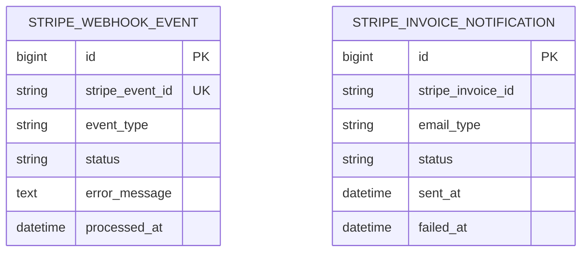
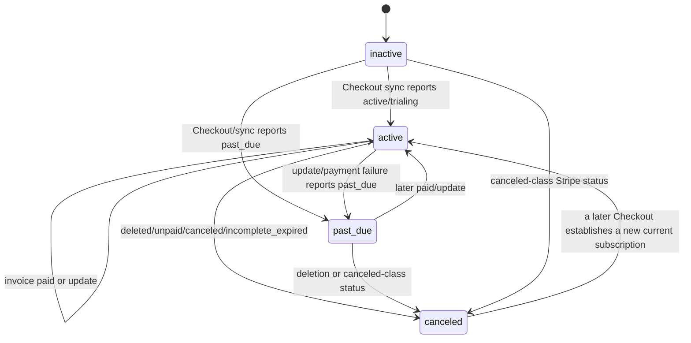
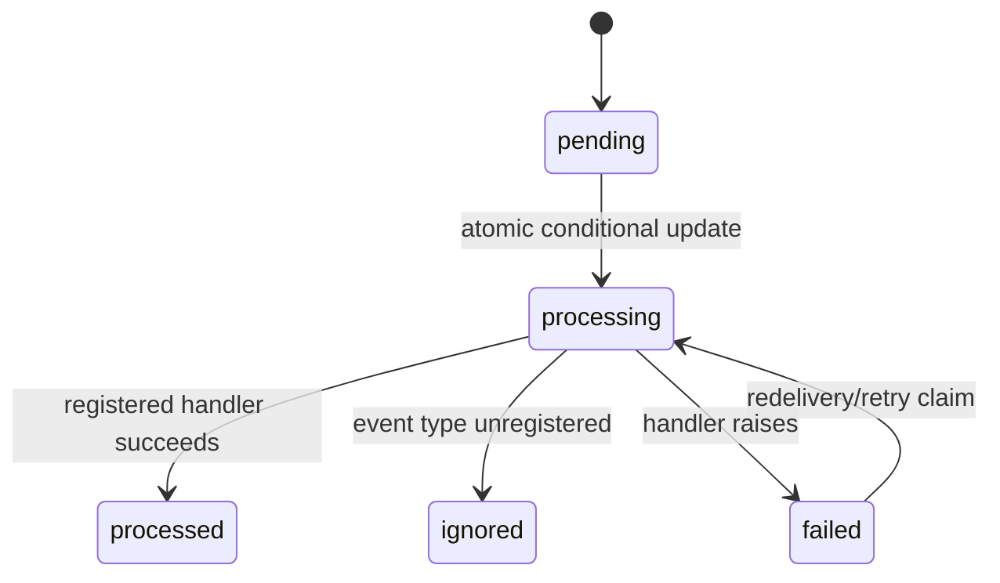

# Data Model and State

> Last analyzed commit: `225c22d13f051a73ffa16efe91fbf1eb0ba2829b` on branch `003-user-pro`  
> Analysis date: 2026-08-02

## Database overview

Production/shared settings configure one MySQL database through Django’s MySQL backend (`chat_connect/settings/base.py::DATABASES`). Tests replace it with SQLite (`chat_connect/settings/settings_tests.py`). There is no multi-database router, database tenancy, soft-delete framework, or confirmed database extension.

Transactions are explicit around signup and subscription state changes. Subscription webhook services lock the one local subscription row with `select_for_update`; bot/topic imports are not transaction-wrapped. Database constraints provide uniqueness for usernames, topic names/messages, Stripe event IDs, Stripe customer IDs, and invoice/email notification pairs.

## Model catalogue

| Model | Purpose | Important fields | Relationships | Constraints | State/lifecycle |
|---|---|---|---|---|---|
| `users.User` | Durable authenticated account | Standard `AbstractUser` username, password, email, active/staff/superuser flags | One profile (`profile`); zero/one subscription (`subscription`) | Username unique; email is **not** database-unique | Created by signup/admin/import; hard delete cascades profile/subscription |
| `users.Profile` | Optional account metadata | `gender` (`M`/`F`, nullable), `link` (nullable URL) | One-to-one `User`, cascade | One row per user | Signup ensures row; import manager can create with supplied data |
| `subscriptions.UserSubscription` | Local source of truth for Pro entitlement and current Stripe relationship | status, Stripe customer/subscription IDs, start/current-period/cancel/end timestamps, cancel-at-period-end | One-to-one `User`, cascade | User one-to-one; `stripe_customer_id` unique nullable; subscription ID not unique | Starts `inactive`; synchronized by Checkout/webhooks; cancellation scheduled then eventually canceled |
| `subscriptions.StripeWebhookEvent` | Idempotency/processing ledger for verified Stripe event | Stripe event ID/type, status, error, processed/created time | None | Stripe event ID unique | `pending` → `processing` → `processed`/`ignored`/`failed`; failed may retry |
| `subscriptions.StripeInvoiceNotification` | Deduplication and delivery state for payment emails | invoice ID, email type, status, sent/failed/error timestamps | None; stores no user FK | Unique `(stripe_invoice_id, email_type)` | `pending` → `sent`/`failed`/`skipped`; failed may be queued again |
| `chat.Topic` | Category for automated message candidates | unique name, max 22 | One-to-many `ConversationFlow` | Name unique | Admin/import managed; hard delete cascades messages |
| `chat.ConversationFlow` | One automated message candidate | message max 300, promotional flag | Many-to-one `Topic`, cascade | Unique `(topic, message)` | Loaded to Redis; non-promotional messages are selectable |

Framework-generated auth, group, permission, session, migration, and admin-log tables also exist but contain no repository-specific schema changes.

## Entity relationships

```mermaid
erDiagram
    USER ||--|| PROFILE : has
    USER ||--o| USER_SUBSCRIPTION : owns
    TOPIC ||--o{ CONVERSATION_FLOW : contains

    USER {
      bigint id PK
      string username UK
      string email
      boolean is_active
      boolean is_staff
      boolean is_superuser
    }
    PROFILE {
      bigint id PK
      bigint user_id FK_UK
      string gender
      string link
    }
    USER_SUBSCRIPTION {
      bigint id PK
      bigint user_id FK_UK
      string status
      string stripe_customer_id UK
      string stripe_subscription_id
      datetime current_period_end
      boolean cancel_at_period_end
    }
    TOPIC {
      bigint id PK
      string name UK
    }
    CONVERSATION_FLOW {
      bigint id PK
      bigint topic_id FK
      string message
      boolean is_promotional
    }
```



The Stripe ledgers intentionally have no foreign keys. Ownership is recovered from `UserSubscription.stripe_customer_id` during webhook processing, and the email task receives a user ID in its Celery payload.

## Ownership and access boundaries

- An authenticated subscription page always queries by `request.user` (`apps/subscriptions/views/detail.py`, `apps/subscriptions/services/user_subscription.py::get_user_subscription`). Cancel and portal actions therefore do not accept an arbitrary user/subscription ID.
- Provider events locate the local owner exclusively by unique Stripe customer ID, then compare the event subscription ID to the stored current ID before updating.
- Checkout success retrieves a session from Stripe and accepts it only when `client_reference_id` equals the logged-in user ID or its customer equals that user’s stored Stripe customer ID (`checkout_success_view`).
- Profile and subscription ownership are enforced structurally by one-to-one foreign keys.
- Guest chat identity has no database owner. `ChatView._has_valid_guest_session` verifies only that both cookies exist and the username is in the active set; it does not validate the `user_id`↔username Redis mappings. `ChatConsumer` then trusts those cookies. This is an unsafe assumed ownership boundary.
- Private chat membership is per WebSocket connection (`consumer.groups`) plus per-user Redis hash. There is no database ownership record or signed invitation.
- There is no organization/tenant/session ownership model beyond Django sessions and the chat cookies.

## State machines and statuses

### Local subscription state



- Initial state is `inactive`.
- `map_stripe_subscription_status` maps provider statuses; `expired` is defined but has no implemented incoming transition.
- `cancel_at_period_end=True` is an orthogonal flag, not a status transition. An active/past-due subscription keeps its current access predicate until provider lifecycle events or period expiry.
- `UserSubscription.pro` additionally evaluates timestamps at read time. Both `active` and `past_due` require a future non-null `current_period_end`; a null end date grants nothing, because it means the period could not be read from Stripe rather than that the entitlement is unbounded.
- Checkout synchronization may replace `stripe_subscription_id`; `mark_subscription_paid`/`mark_subscription_payment_failed` only set it when it is empty. All lifecycle methods return `None` for an event carrying a different, non-current subscription ID.
- Tests under `apps/subscriptions/tests/services/user_subscription/` verify mapping, locks, stale-event rejection, period fields, cancellation, and deletion.

### Webhook event claim



`processing`, `processed`, and `ignored` cannot be reclaimed. No timestamp threshold or cleanup process releases an event stranded in `processing` after a process crash. The intended tests exist only as commented code in the untracked working-tree file `apps/subscriptions/tests/services/test_webhook_handlers.py`.

### Invoice notification

`pending` is created by `queue_invoice_email_notification`; a task sets `sent` after delivery, `failed` before raising/retrying, or `skipped` for an unknown email type. A task returns immediately only for `sent`, so retries of a `failed` notification attempt delivery again. There is no explicit `processing` claim, row lock, or attempt counter.

## Transactions and concurrency

| Area | Protection | Remaining concern |
|---|---|---|
| Signup | `create_user_account_from_signup_form` is `transaction.atomic` | Stripe Checkout is called after this transaction, so a provider failure leaves a valid account/local subscription |
| Subscription webhook state | Each mutation is atomic and obtains `select_for_update` by customer ID | SQLite tests cannot prove production MySQL lock timing; service-level tests mock/inspect lock use |
| Current subscription replacement | Checkout sync locks row and writes a complete snapshot | Multiple Checkout sessions/subscriptions can be created before webhooks; whichever Checkout event is processed last becomes current |
| Webhook event claim | Unique event ID plus conditional `UPDATE status IN (pending, failed)` | A crash leaves `processing` permanently; no retry scheduler |
| Invoice enqueue | Unique invoice/type; `transaction.on_commit` | Two distinct events can queue concurrent tasks while notification is pending; tasks do not claim the row before sending |
| Cancellation | Provider call then local save | No row lock or application idempotency; concurrent POSTs can call Stripe more than once |
| Stripe customer/Checkout creation | Reuses saved customer | No local lock or Stripe idempotency key; concurrent first requests may create orphan customers and duplicate paid subscriptions |
| Bot selection | One-hour sent marker | Check-then-mark is not atomic; concurrent workers can choose the same message |
| Topic import | Database uniqueness and `get_or_create` | No encompassing transaction; concurrent/preexisting duplicates can make `bulk_create` fail after partial topic creation |
| User/profile import | Per-row exception handling | User creation and profile creation are not atomic in the custom manager |

## Cache and temporary state

All application chat keys use the Redis connection at `REDIS_CHANNEL_LAYER_URL`, meaning the Channels logical database also holds presence/private/bot state. Django’s configured cache uses its separate database and prefix. See [`docs/redis-architecture-and-key-reference.md`](../redis-architecture-and-key-reference.md) for the full key/TTL reference — the table below is a summary.

| Key / state | Type and value | TTL | Created/read/cleanup |
|---|---|---|---|
| `chatconnect:users:usernames` | Set of lowercased active and bot usernames | None | Added by registration/connect/bot load; removed on WebSocket disconnect/logout; stale entries can persist if cleanup fails |
| `chatconnect:user:username:{username}` | String username→ID | Default `CACHE_TIMEOUT_ONE_DAY` (120 seconds in development override) | `register_user_on_redis` uses NX; not validated during guest reconnect |
| `chatconnect:user:id:{user_id}` | String ID→username | Same default | Written NX; not used as an ownership check |
| `user:next_id` | Integer counter generating base-36 guest IDs like `u_00001` | None | Incremented synchronously; not namespaced by `chatconnect` |
| `chatconnect:user:online:{user_id}` | String `1` | 90 seconds | Set on connect/heartbeat; deleted on disconnect |
| `chatconnect:user:private_chats:{user_id}` | Hash target ID→private group | 30 minutes | Saved on either side of an invite; restored and TTL-refreshed on reconnect; no field-delete/leave path |
| `chatconnect.user.inbox.{user_id}` | Channels group name | Channel-layer lifetime | Joined after public group registration; used for invites/offline notifications |
| `chatconnect:bots:cache_loaded` | String flag | One week | Prevents reload from MySQL |
| `chatconnect:bots:user_ids`, `...:usernames`, topic/message caches | Sets/hashes | One week | Loaded from MySQL by `BotCacheLoader` |
| `chatconnect:bots:messages:sent:{message_id}` | String suppression marker | One hour | Set after selection |
| `chatconnect:bots:ids` | Set of IDs recognized as bots | None | Added during bot load; no removal/expiry |
| Browser cookies `username`, `user_id` | HTTP-only strings | Session cookies; no explicit max age | Set by chat/signup/login, deleted by logout/invalid guest redirect |
| Django session | Database-backed default session | Django default policy | Authenticates registered HTTP/WebSocket users through `AuthMiddlewareStack` |
| Per-connection `groups` | Python `set` | Socket lifetime | Membership authorization and disconnect cleanup |
| Per-connection `private_chats` | Python dict target ID→group | Socket lifetime, reconstructed from Redis | Used for limits, partner notifications, and restoration |

Potential consistency issues include username-set entries without live markers, online markers with removed usernames, mappings that disagree because writes use NX, bot members that never expire, multiple sockets clearing shared state, and Redis flushes affecting both Channels and application state.

## Data lifecycle

- **Users:** created by signup, admin, or S3 import. No account deletion UI or retention job exists. Hard deletion cascades profile and subscription. Stripe provider objects are not deleted by model cascade.
- **Profiles/subscriptions:** signup creates both; other account creation paths may omit one. Checkout lazily creates a missing local subscription.
- **Subscription history:** one row is overwritten with the current provider snapshot. Prior Stripe subscription IDs/states are not archived.
- **Webhook events:** accumulate indefinitely; no retention/cleanup/archiving task.
- **Invoice notifications:** accumulate indefinitely and are not linked by FK to user; deleting a user does not remove them.
- **Topics/flows:** created by admin/import, updated normally, hard-deleted with cascade. Bot Redis cache may remain stale for up to a week unless its loaded flag/data expire or are manually cleared.
- **User chat messages:** never written to MySQL/Redis by the chat workflow; they live only in current browser DOM and Channels delivery.
- **Presence/private chats:** TTL or disconnect cleanup is the only lifecycle. Private chats have no explicit close/delete protocol; message content cannot become orphaned because it is never stored.
- **Celery Beat schedule:** the local `celerybeat-schedule` file is generated runtime state and was present untracked; it should not be committed or edited.
