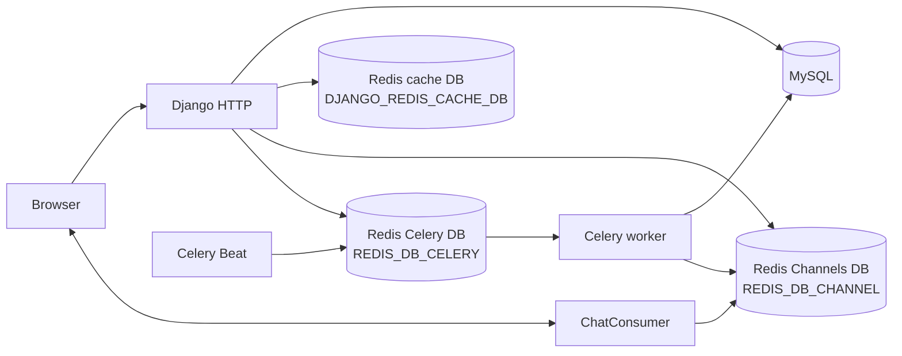
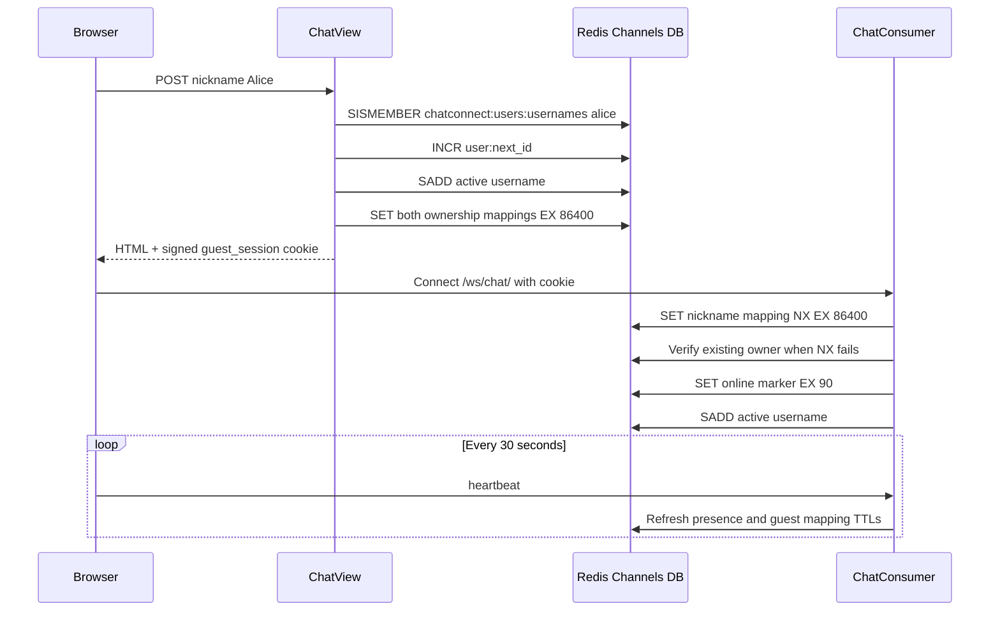
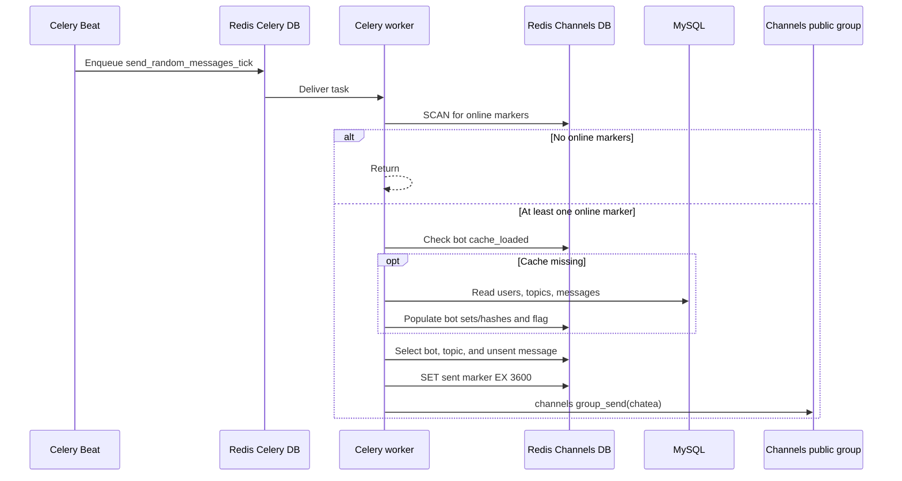

# Redis Architecture and Key Reference

> Repository: Chatea Conecta  
> Branch analyzed: `003-user-pro`  
> Redis-related source verified through commit: `c1cf29616e271d1316113edd2ab2464dc1199468`  
> Analysis date: 2026-08-02

## 1. Purpose and scope

This page explains every Redis responsibility found in the current application. It is intended to be copied directly into the GitHub wiki and used by developers who need to understand, inspect, troubleshoot, or change Redis-backed behavior.

The application uses one Redis server for three separate purposes:

1. Django's HTTP response cache.
2. Django Channels transport plus application-owned chat state.
3. The Celery task broker.

These purposes normally use separate Redis logical databases. Keeping those database numbers distinct is essential: a cache clear must not accidentally remove WebSocket state or queued background work.

This document covers:

- Configuration and database separation.
- The synchronous and asynchronous Redis clients.
- Every application-owned key, including its type, value, TTL, readers, writers, and cleanup path.
- Framework-owned Django, Channels, and Celery keys.
- Guest identity, presence, private-chat, bot-message, and background-task flows.
- Safe inspection and troubleshooting examples.
- Test coverage and known implementation caveats.

Redis does **not** store durable user accounts, subscriptions, Stripe event records, topics, or conversation-flow records. Those live in MySQL. Redis also does not store user chat history; chat messages are ephemeral Channels events.

Framework-internal examples in this page are version-specific. The analyzed dependency set is:

| Component | Version |
|---|---:|
| Redis server image | 7.2.4 |
| Django | 4.2.16 |
| Channels | 4.1.0 |
| channels-redis | 4.2.0 |
| Celery | 5.4.0 |
| Kombu | 5.4.2 |
| redis-py | 5.1.1 |

## 2. Architecture at a glance

The recommended environment values in `.env.example` are:

| Logical database | Environment variable | Recommended index | Owner | Main purpose |
|---|---|---:|---|---|
| Cache DB | `DJANGO_REDIS_CACHE_DB` | `0` | Django | Production HTTP response cache |
| Channels DB | `REDIS_DB_CHANNEL` | `1` | Channels and `apps.chat` | WebSocket groups/messages, identity, presence, private chats, and bot state |
| Celery DB | `REDIS_DB_CELERY` | `2` | Celery/Kombu | Queued bot ticks and subscription email tasks |

The numbers are configurable. Do not assume they are `0`, `1`, and `2` when inspecting a deployed environment; check its environment variables first.



The most important implementation detail is that the application's own Redis wrappers do **not** use Django's cache connection. Both `RedisService` and `AsyncRedisService` connect to `REDIS_CHANNEL_LAYER_URL`, so all `chatconnect:*` application keys share the Channels logical database with Channels' internal `asgi*` keys.

## 3. Configuration

### 3.1 Connection settings

Shared configuration lives in `chat_connect/settings/base.py`:

```python
REDIS_PROTOCOL = os.getenv("REDIS_PROTOCOL", "rediss")
REDIS_PASSWORD = os.getenv("REDIS_PASSWORD", "")
REDIS_HOST = os.getenv("REDIS_HOST", "localhost")
REDIS_PORT = os.getenv("REDIS_PORT", "6379")
REDIS_URL = f"{REDIS_PROTOCOL}://:{REDIS_PASSWORD}@{REDIS_HOST}:{REDIS_PORT}"
```

The base URL has no logical database suffix. Each Redis role selects its database separately:

```python
# Django cache: the DB is passed as an option.
CACHES["default"]["LOCATION"] = REDIS_URL
CACHES["default"]["OPTIONS"]["db"] = DJANGO_REDIS_CACHE_DB

# Channels and application-owned chat state: the DB is in the URL.
REDIS_CHANNEL_LAYER_URL = f"{REDIS_URL}/{REDIS_DB_CHANNEL}"

# Celery broker: the DB is in the URL.
CELERY_BROKER_URL = f"{REDIS_URL}/{REDIS_DB_CELERY}"
```

| Variable | Base default | Required behavior |
|---|---|---|
| `REDIS_PROTOCOL` | `rediss` | Use `redis` for the repository's plaintext Docker Redis. Use `rediss` only when the server actually supports TLS. |
| `REDIS_PASSWORD` | Empty string | Must match the Redis server's configured password. Never commit a production value. |
| `REDIS_HOST` | `localhost` | Compose overrides this to `my-redis` for application containers. |
| `REDIS_PORT` | `6379` | Compose uses `6379` in development and production. |
| `DJANGO_REDIS_CACHE_DB` | `0` | Cache logical database. |
| `REDIS_DB_CHANNEL` | No default | Channels and application-state logical database. This must be set. |
| `REDIS_DB_CELERY` | No default | Celery broker logical database. This must be set. |

If either `REDIS_DB_CHANNEL` or `REDIS_DB_CELERY` is missing, the derived URL ends in `/None`. Treat both variables as required even though `base.py` does not fail fast with a friendly configuration error.

### 3.2 Docker topology

Both `docker-compose.dev.yml` and `docker-compose.prod.yml` run Redis 7.2.4 as the `my-redis` service and name its container `redis`. Django, Celery, and Celery Beat reach it through the Compose network at `my-redis:6379`.

The Redis service mounts `redis.conf`, whose current visible configuration is limited to:

```text
port 6379
requirepass <local password>
```

There is no Redis data volume in either main Compose file. Redis state should therefore be treated as disposable across container replacement, even if the running server creates snapshots inside its container filesystem.

Production also publishes Redis port `6379` to the host. Network access must be restricted by the VPS firewall because password authentication is not a substitute for network isolation.

### 3.3 Environment-specific behavior

| Environment | Django cache | Channel layer | Celery broker | Application keys |
|---|---|---|---|---|
| Development | Redis backend configured, but no cache middleware and no direct cache API calls were found | `RedisChannelLayer`, message expiry explicitly `60s` | Redis | Real Redis through the raw sync/async clients |
| Production | Redis plus whole-site update/fetch cache middleware, `900s` cache duration | `RedisChannelLayer`; its library default message expiry is `60s` | Redis | Real Redis through the raw sync/async clients |
| Tests | `LocMemCache` | `InMemoryChannelLayer` | `memory://localhost` | Still import the raw Redis clients, but discovered tests mock service methods or replace the sync client with an in-memory stand-in |

The test overrides do not automatically replace `RedisService` or `AsyncRedisService`. Those wrappers are independent of Django's `CACHES` and `CHANNEL_LAYERS` test replacements.

## 4. Redis access layers

### 4.1 Django cache backend

`CACHES["default"]` uses Django's built-in `django.core.cache.backends.redis.RedisCache`. Its configured key prefix is `chatconnect`.

No application code currently calls `django.core.cache.cache` directly. Redis cache entries are created by the production cache middleware inserted in `chat_connect/settings/settings_production.py`.

### 4.2 Synchronous application client

`apps/chat/infrastructure/redis/sync_client.py` creates one process-level `redis.ConnectionPool` and `redis.Redis` client using `REDIS_CHANNEL_LAYER_URL` with `decode_responses=True`.

`apps/chat/infrastructure/redis/sync_redis_service.py::RedisService` wraps the commands used by HTTP views, guest registration, bot selection, and Celery workers:

| Wrapper behavior | Redis command |
|---|---|
| Read/write a string | `GET`, `SET` |
| Claim a key only when absent | `SET ... NX EX ...` |
| Generate the next guest ID | `INCR` |
| Manage sets | `SADD`, `SREM`, `SISMEMBER`, `SCARD`, `SRANDMEMBER` |
| Manage hashes | `HSET`, `HGET`, `HGETALL` |
| Manage lifetime and cleanup | `EXPIRE`, `DEL` |
| Detect at least one matching presence key | cursor-based `SCAN` through `scan_iter` |

### 4.3 Asynchronous application client

`apps/chat/infrastructure/redis/async_client.py` creates an async Redis pool with the same `REDIS_CHANNEL_LAYER_URL`. The actual client is initialized lazily by `get_aio_redis_client()`.

`AsyncRedisService` is used by `ChatConsumer` and its action services so WebSocket handling does not block the event loop with synchronous Redis calls. It wraps `GET`, `SET`, `DEL`, `SADD`, `SREM`, `SISMEMBER`, `SCARD`, `HSET`, `HGETALL`, and `EXPIRE`.

Two wrapper areas are currently dormant:

- `AsyncRedisService.set_if_not_exists()` has no production caller. Unlike the active `set_value(..., nx=True)` path, it uses `SETNX` without attaching a TTL.
- `RedisService.store_in_hash()` and `set_hash_expiration()` are retained from the old bot-message service. The first is explicitly marked for deletion, and neither has a current production caller.

These methods do not create additional live key patterns today.

### 4.4 Channels layer

`channels_redis.core.RedisChannelLayer` is configured independently, although it points at the same URL and logical database as the two application clients. It manages framework-owned WebSocket group membership and message queues. Application code should use `group_add`, `group_discard`, and `group_send` instead of reading or writing Channels' internal keys.

### 4.5 Celery broker

Celery and Kombu connect to `CELERY_BROKER_URL`. Redis is used as a broker only; the project does not configure `CELERY_RESULT_BACKEND`, so task return values are not stored in Redis.

The broker carries:

- Periodic `apps.chat.tasks.send_random_messages_tick` tasks from Celery Beat.
- Invoice notification email tasks.
- Subscription cancellation email tasks.

The local `celerybeat-schedule` file is Beat's schedule database. It is not a Redis key and should not be confused with queued tasks in the broker database.

## 5. Key naming rules

Most application-owned keys begin with the namespace `chatconnect`:

```text
chatconnect:<area>:<resource>:<identifier>
```

Conventions in the current code are:

- Usernames used as key segments or set members are lowercased.
- User IDs are stored as strings. Authenticated users use their database primary key; guests receive a generated ID such as `u_00001`.
- Dynamic values are represented in this document with braces, for example `{user_id}`.
- Redis types matter. A string key cannot be safely treated as a set or hash.
- A logical database number is not part of the key text. The same text can exist independently in DB 0, DB 1, and DB 2.
- `chatconnect.user.inbox.{user_id}` uses dots because it is a Channels **group name**, not an application data-key format. Channels turns it into its own internal Redis group key.

One application key is not namespaced: `user:next_id`. This is called out separately below.

## 6. Complete application-owned key catalogue

Unless stated otherwise, every key in this section is stored in the logical database selected by `REDIS_DB_CHANNEL`.

### 6.1 Summary

| Key pattern | Type | Example content | TTL | Purpose |
|---|---|---|---:|---|
| `user:next_id` | String integer | `42` | None | Monotonic source for generated guest IDs |
| `chatconnect:users:usernames` | Set | `alice`, `bob_bot` | None | Nicknames considered active or reserved by bot identities |
| `chatconnect:user:username:{username}` | String | `u_00016` | 1 day | Authoritative lowercase nickname to user-ID ownership mapping |
| `chatconnect:user:id:{user_id}` | String | `Alice` | 1 day | Reverse user-ID to display-username mapping |
| `chatconnect:user:online:{user_id}` | String | `1` | 90 seconds | Heartbeat-backed online marker |
| `chatconnect:user:private_chats:{user_id}` | Hash | field `42` -> `private-u_00016-42` | 30 minutes | Private chats restored after refresh/reconnect |
| `chatconnect:bots:user_ids` | Set | `12`, `18` | 1 week | Bot IDs eligible for random automatic messages |
| `chatconnect:bots:usernames` | Hash | field `12` -> `maria_bot` | 1 week | Username lookup for a selected bot ID |
| `chatconnect:bots:topic_ids` | Set | `3`, `7` | 1 week | Topic IDs eligible for bot-message selection |
| `chatconnect:bots:topics:{topic_id}:messages` | Hash | field `501` -> message text | 1 week | Candidate messages for one topic |
| `chatconnect:bots:cache_loaded` | String | `1` | 1 week | Flag that prevents repeated MySQL-to-Redis bot loading |
| `chatconnect:bots:messages:sent:{message_id}` | String | `1` | 1 hour | Temporary duplicate-message suppression marker |
| `chatconnect:bots:ids` | Set | `12`, `18` | None | IDs recognized as bots during private-chat validation |

### 6.2 `user:next_id`

This string/integer counter is incremented with `INCR` whenever a guest joins without an existing user ID. The integer is converted to base 36, padded to five characters, and prefixed with `u_`.

Example:

```text
INCR user:next_id -> 42
generated application ID -> u_00016
```

Writer: `RedisService.create_user_id()`  
Reader: Redis itself during `INCR`; application code does not otherwise read it  
Cleanup: none  
TTL: none

This key is deliberately simple, but unlike the rest of the application keys it lacks the `chatconnect:` namespace.

### 6.3 `chatconnect:users:usernames`

This set contains lowercased usernames that the chat considers active or unavailable for a new guest.

Writers:

- `register_user_on_redis()` adds every guest or authenticated user rendered into chat.
- `register_username_as_active()` re-adds a username on WebSocket connect/reconnect.
- `BotMessageRedisStore.register_bot_user()` adds bot usernames during bot-cache loading.

Readers:

- `ChatView._username_already_exists()` rejects a guest nickname already in the set.
- `HomeChatView` uses `SCARD` for its displayed people count.
- `get_online_users_count()` uses `SCARD` for the WebSocket room count.

Cleanup:

- WebSocket disconnect calls `cleanup_user_presence()`, which removes the username.
- Explicit logout removes it through `CloseChatSessionView`.
- Bot usernames are never explicitly removed.

TTL: none. Redis sets cannot expire individual members; only the whole key can have a TTL, and this key has none.

Despite the names of the count functions, this is not a reliable count of live WebSocket connections. It is a nickname-reservation set that also includes bots.

### 6.4 `chatconnect:user:username:{username}`

This string is the authoritative ownership mapping for a guest nickname.

Example:

```text
key:   chatconnect:user:username:alice
value: u_00016
TTL:   86400 seconds after registration or refresh
```

The username segment is always lowercased. Registration writes the mapping for both guests and authenticated users, but the ownership validation is security-critical only for guests.

Guest validation uses an atomic `SET NX` attempt:

1. If the key is absent, the signed guest token can reclaim it with its user ID.
2. If the key exists, its value must equal the ID in the signed token.
3. On success, its TTL is refreshed.
4. If it belongs to a different ID, HTTP chat entry or the WebSocket connection is rejected.

Writers: `register_user_on_redis()`, `claim_guest_identity()`, `aclaim_guest_identity()`  
Readers: sync and async guest-identity claims  
Refresh: guest HTTP entry and the 30-second WebSocket heartbeat  
Cleanup: explicit guest logout deletes it; otherwise it expires  
TTL: `GUEST_SESSION_MAX_AGE`, currently 86,400 seconds (one day)

### 6.5 `chatconnect:user:id:{user_id}`

This reverse string maps an ID back to the display-cased username.

Example:

```text
key:   chatconnect:user:id:u_00016
value: Alice
TTL:   86400 seconds
```

It is written and refreshed alongside the nickname-to-ID key. Explicit logout deletes it.

No current production path reads this reverse mapping. Guest ownership validation reads `chatconnect:user:username:{username}` instead. The reverse key is therefore supporting state rather than part of the current authorization decision.

### 6.6 `chatconnect:user:online:{user_id}`

This string is the actual short-lived online-presence marker.

Example:

```text
key:   chatconnect:user:online:u_00016
value: 1
TTL:   90 seconds
```

Lifecycle:

1. `ChatConsumer.connect()` sets it after accepting the WebSocket.
2. Browser code in `apps/chat/static/js/chatSocket.js` sends a heartbeat every 30 seconds.
3. `handle_heartbeat()` rewrites the marker with a fresh 90-second TTL.
4. Normal disconnect deletes the key immediately.
5. If disconnect cleanup never runs, Redis expires it after at most 90 seconds from the last successful heartbeat.

Readers:

- Private-invite validation checks whether a target user is online.
- The bot tick uses `SCAN` for `chatconnect:user:online:*` and exits when no marker exists.

The marker tracks a user ID, not a connection ID, so simultaneous browser tabs share one key.

### 6.7 `chatconnect:user:private_chats:{user_id}`

This hash stores private chats that should be restored when a user refreshes or reconnects.

Example:

```text
key:   chatconnect:user:private_chats:u_00016
field: 42
value: private-u_00016-42
TTL:   1800 seconds on the whole hash
```

Each field is the other participant's user ID. Each value is the Channels group name for that private conversation.

The inviting side writes its hash entry before sending the invite. The receiving consumer writes its own entry when it handles the `chat.invite` Channels event. On reconnect, `restore_user_private_chat_groups()`:

1. Reads the complete hash with `HGETALL`.
2. Sends the mapping to the browser.
3. Re-adds the current channel to every stored private Channels group.
4. Notifies those groups that the participant is online again.
5. Refreshes the hash TTL to 30 minutes.

TTL: `PRIVATE_CHATS_TTL`, currently 1,800 seconds. Writing any one field refreshes the TTL of the whole per-user hash.

There is no implemented field deletion or leave-private-chat action. Entries disappear only when the entire hash expires, the logical database is cleared, or an operator deletes the key.

### 6.8 Bot cache keys

`BotCacheLoader` reads MySQL and prepares Redis for fast random selection by the Celery worker.

#### `chatconnect:bots:user_ids`

A set of IDs for every database user flagged with `User.is_bot`. `SRANDMEMBER` selects a random sender. Ordinary customer accounts are excluded because they are never flagged; inactive users are still included, since the loader applies no `is_active` filter. TTL: one week.

#### `chatconnect:bots:usernames`

A hash mapping bot user ID to username. It supplies the sender name after an ID is selected. TTL: one week.

#### `chatconnect:bots:topic_ids`

A set of all `Topic` model IDs. `SRANDMEMBER` selects a topic. TTL: one week.

#### `chatconnect:bots:topics:{topic_id}:messages`

One hash per topic. The hash field is a `ConversationFlow` ID and the value is its non-promotional message text. TTL: one week.

Example:

```text
key:   chatconnect:bots:topics:7:messages
field: 501
value: Anyone from Madrid?
```

#### `chatconnect:bots:cache_loaded`

A string flag with value `1`. If it exists, `BotMessageService` assumes the other bot cache keys are ready and skips MySQL loading. TTL: one week.

Deleting only this flag forces a reload on the next bot tick. Nothing in the codebase deletes it, so an `is_bot` change made after the cache is warm is not picked up until the one-week TTL expires, unless the key is removed by hand:

```
redis-cli DEL chatconnect:bots:cache_loaded
```

The loader clears the bot user keys (`bots:user_ids`, `bots:usernames`, `bots:ids`) before repopulating them, so a reload fully reconciles bot membership. Topic and message keys are still written without clearing, so deleted topics or conversation flows survive a reload until their TTL expires.

#### `chatconnect:bots:messages:sent:{message_id}`

A string flag with value `1` and a one-hour TTL. The selection service skips a conversation-flow message while this marker exists, reducing visible repetition.

The selection check and marker write are separate operations. Two concurrent workers can select the same message before either one creates its marker.

#### `chatconnect:bots:ids`

A non-expiring set used to answer "is this target a bot?" during private invitations. Bots do not need an online-presence marker to receive a private-chat request.

This set overlaps conceptually with `chatconnect:bots:user_ids`, but the two serve different code paths and have different lifetimes:

- `bots:user_ids`: one-week selection cache.
- `bots:ids`: bot-recognition set with no TTL, so it is only ever emptied by the loader's clear step.

### 6.9 Defined but currently unused promotional keys

The following constants exist in `apps/chat/constants/bot_message_redis_keys.py`, but no current production writer or reader references them:

| Key pattern | Intended type/purpose |
|---|---|
| `chatconnect:bots:promotional_links` | Hash of bot user ID to promotional/profile link |
| `chatconnect:bots:promotional_user_ids` | Set of bot IDs with promotional links |
| `chatconnect:bots:promotional_topic_ids` | Set of promotional topic IDs |
| `chatconnect:bots:promotional_topics:{topic_id}:messages` | Hash of promotional messages for one topic |

These are reserved key names, not proof that promotional bot messaging is implemented.

## 7. Channels group names and framework-owned keys

### 7.1 Application group names

The application uses three group-name families:

| Group name | Example | Purpose |
|---|---|---|
| Public room | `chatea` | Main group chat and bot broadcasts |
| Personal notification inbox | `chatconnect.user.inbox.{user_id}` | Private invites and offline notifications |
| Private chat | `private-{user1_id}-{user2_id}` | Events and messages between two participants |

These values are Channels API group names. They should not be passed to `RedisService` as though they were application data keys.

### 7.2 How channels-redis stores them

The installed `channels-redis==4.2.0` uses the default prefix `asgi` because the project does not override it.

Group membership is stored in sorted sets such as:

```text
asgi:group:chatea
asgi:group:chatconnect.user.inbox.u_00016
asgi:group:private-u_00016-42
```

Sorted-set members are generated channel names; their scores are join timestamps. Group keys use the library's default `group_expiry` of 86,400 seconds. `group_send()` also removes membership entries older than that threshold.

Per-channel pending messages use generated sorted-set keys beginning with `asgi`, commonly resembling:

```text
asgispecific.<generated-process-and-channel-name>!
```

Those keys contain serialized event envelopes and expire after 60 seconds. Their names and encoding are channels-redis implementation details and must not be used as an application API.

Application calls that create or use these internal keys are:

- `register_user_to_group()` -> `group_add()`.
- `ChatConsumer.unregister_user_from_all_groups()` -> `group_discard()`.
- Chat, presence, invite, and bot broadcast helpers -> `group_send()`.

Production redefines `CHANNEL_LAYERS` without the explicit base `expiry` option, but channels-redis 4.2.0 also defaults to 60 seconds, so the effective pending-message lifetime remains 60 seconds.

## 8. Django cache keys

Django cache keys live in `DJANGO_REDIS_CACHE_DB`, not in the Channels/application database.

Production installs `UpdateCacheMiddleware` and `FetchFromCacheMiddleware` and sets `CACHE_MIDDLEWARE_SECONDS = 900`. Django stores both a response and a list of relevant `Vary` headers.

The configured Django cache prefix is `chatconnect`, and Django's default cache version is `1`. Effective keys therefore resemble:

```text
chatconnect:1:views.decorators.cache.cache_header.<url-hash>.<language/time-zone suffix>
chatconnect:1:views.decorators.cache.cache_page..GET.<url-hash>.<headers-hash>.<language/time-zone suffix>
```

The exact hashes and suffixes depend on the URL, request headers, active language, and time zone. Do not hard-code or parse them.

Important boundaries:

- The middleware is enabled only in production settings.
- No explicit application `cache.get()` or `cache.set()` calls were found.
- WebSocket frames are not stored in Django's response cache.
- Django sessions are database-backed by default in this project; they are not Redis cache entries.
- Clearing only the cache logical database forces HTTP responses to be regenerated but should not remove chat identity or queued Celery tasks.

## 9. Celery/Kombu broker keys

Celery broker data lives in `REDIS_DB_CELERY`.

The project does not define custom task routes or a custom default queue, so Celery uses its default queue name, `celery`. With the installed Kombu Redis transport, keys commonly include:

| Key | Redis type | Purpose |
|---|---|---|
| `celery` | List | Default ready-task queue |
| `celery<priority-separator>3`, `...6`, `...9` | List | Optional priority buckets when non-zero priorities are used |
| `_kombu.binding.celery` | Set | Queue/exchange/routing binding metadata |
| `unacked` | Hash | Payloads delivered to a worker but not yet acknowledged |
| `unacked_index` | Sorted set | Delivery timestamps used for visibility-timeout restoration |
| `unacked_mutex` | Lock/string | Mutex used while restoring expired unacknowledged tasks |

Remote-control commands such as `celery status` can also create transient pidbox and reply-related broker keys.

These are Kombu implementation details. Inspect them for diagnostics, but publish work with Celery's task API rather than writing queue lists manually.

Because no result backend is configured, keys such as `celery-task-meta-<task-id>` should not be created by this application for task results.

## 10. End-to-end lifecycles

### 10.1 Guest registration and identity



The signed cookie proves the server issued a `(username, user_id)` pair. The nickname-to-ID Redis mapping proves the nickname still belongs to that ID. Both checks are required for a guest to re-enter the HTTP chat or connect a WebSocket.

On ordinary WebSocket disconnect, the active username and online marker are removed, but the ownership mappings remain until their TTLs expire. On explicit logout, both ownership mappings are deleted and the signed cookie is cleared.

### 10.2 Authenticated user entry

Authenticated users are trusted through Django's database-backed session. `ChatView`, login, and signup call `register_user_on_redis()` with the database user's primary key, populate the active set and mapping strings, and issue the legacy `username` and `user_id` HTTP-only cookies used by existing browser behavior.

The WebSocket consumer ignores those identity cookies for authenticated connections and reads `scope["user"]` from `AuthMiddlewareStack`.

### 10.3 Presence and room counts

Two different Redis concepts are involved:

- `chatconnect:user:online:{user_id}` answers whether an ID has recently maintained a WebSocket heartbeat.
- `chatconnect:users:usernames` answers which nicknames are currently reserved/registered and also contains bot names.

The UI's displayed counts use the username set, not the online-marker keys:

- The home page uses the set size when it is greater than five; otherwise it displays a random number from 55 through 63.
- Registering the public group broadcasts the set size plus 60.

The bot task makes a different decision: it scans for at least one actual `user:online:*` marker before sending a message.

### 10.4 Public WebSocket message

1. The browser opens `/ws/chat/`.
2. It sends `register_group` for `chatea`.
3. The consumer joins the public group and its personal notification group.
4. The browser sends `send_message` with group `chatea`.
5. `broadcast_chat_message()` calls Channels `group_send()`.
6. channels-redis stores and fans out the event through its internal `asgi*` keys.
7. Each consumer's `chat_message()` sends JSON to its browser.

The user message is not written to a durable application key or MySQL model.

### 10.5 Private chat

1. The inviter sends `private_invite` with a target ID.
2. The handler rejects self-invites, duplicate local chats, and free-account requests over the limit.
3. It checks `chatconnect:user:online:{target_id}`; a target in `chatconnect:bots:ids` is allowed even without presence.
4. It creates a group name such as `private-u_00016-42`.
5. The inviter joins the Channels group and stores the group in its private-chat hash.
6. A real user's personal notification group receives `chat.invite`.
7. The target joins the private group and stores its own reverse hash entry.
8. Both sides can restore the group from their hashes for 30 minutes after the last write/reconnect refresh.

### 10.6 Automated bot message



The base Beat interval is three seconds; development overrides it to 60 seconds. Each tick has a 90% probability of continuing after confirming that at least one online marker exists.

## 11. Inspecting Redis safely

### 11.1 Connect to the correct logical database

When Redis runs through the repository's Compose files, the container is named `redis`.

Interactive example:

```shell
docker exec -it redis redis-cli -a '<redis-password>'
```

Then select the intended logical database:

```redis
SELECT 1
PING
```

Replace `1` with the deployed value of `REDIS_DB_CHANNEL`. Avoid placing a real production password directly in shell history; prefer a protected environment variable or secret-management mechanism supported by the host.

### 11.2 Inspect the keyspace

Use `SCAN`, not `KEYS *`, on production data:

```redis
INFO keyspace
SCAN 0 MATCH chatconnect:* COUNT 100
SCAN 0 MATCH asgi* COUNT 100
```

`SCAN` is cursor-based. If the returned cursor is not `0`, call it again using the returned cursor until Redis returns `0`.

### 11.3 Inspect application keys

```redis
TYPE chatconnect:users:usernames
SCARD chatconnect:users:usernames
SMEMBERS chatconnect:users:usernames

GET chatconnect:user:username:alice
TTL chatconnect:user:username:alice

GET chatconnect:user:online:u_00016
TTL chatconnect:user:online:u_00016

HGETALL chatconnect:user:private_chats:u_00016
TTL chatconnect:user:private_chats:u_00016

SMEMBERS chatconnect:bots:user_ids
HGETALL chatconnect:bots:usernames
HGETALL chatconnect:bots:topics:7:messages
```

Redis `TTL` meanings:

| Result | Meaning |
|---:|---|
| Positive integer | Seconds remaining |
| `-1` | Key exists but has no expiry |
| `-2` | Key does not exist |

Bot message values and usernames can contain user-visible data. Treat command output and diagnostic logs as potentially sensitive.

### 11.4 Inspect framework roles

Cache database:

```redis
SCAN 0 MATCH chatconnect:1:* COUNT 100
```

Channels database:

```redis
SCAN 0 MATCH asgi:group:* COUNT 100
TYPE asgi:group:chatea
ZCARD asgi:group:chatea
TTL asgi:group:chatea
```

Celery database:

```redis
LLEN celery
HLEN unacked
ZCARD unacked_index
SMEMBERS _kombu.binding.celery
```

Do not edit serialized Channels events, Kombu envelopes, binding sets, or unacknowledged-task indexes manually.

## 12. Clearing and rebuilding state

Different clearing operations have very different consequences:

| Target | Immediate consequence | Recovery |
|---|---|---|
| Django cache DB only | Cached HTTP responses disappear | Django regenerates them on request |
| One guest's ownership keys | Its old signed token can no longer prove current ownership | Guest must rejoin; be careful not to free another user's nickname |
| Bot `cache_loaded` flag | Next eligible bot tick reloads MySQL data | Automatic, but existing stale collection members are not removed first |
| Entire Channels DB | Active identities, presence, private-chat restoration, bot cache, Channels groups, and pending socket events disappear | Clients must reconnect; bot cache reloads; guest behavior depends on surviving browser tokens |
| Entire Celery DB | Ready and broker-maintained in-flight tasks disappear | Lost tasks require application-specific replay; email rows alone do not automatically republish every task |
| `FLUSHALL` | Every Redis logical database is cleared | Combines all consequences above |

The deployment workflow currently offers a `clear_redis` input that runs `FLUSHALL`. It does so after restarting the application containers. This is a full-system reset, not a Django cache clear, and can remove tasks published by the newly restarted services.

For normal HTTP cache invalidation, target only `DJANGO_REDIS_CACHE_DB` during a controlled deployment. Do not use `FLUSHALL` merely to refresh templates, static files, or bot data.

Before any deletion:

1. Confirm the Redis host and environment.
2. Confirm the selected logical database with `CLIENT INFO`/connection configuration and `INFO keyspace`.
3. Inspect candidate keys with `SCAN`.
4. Understand whether the key is application-owned or framework-owned.
5. Prefer a maintenance window for Channels or Celery state.
6. Record how lost tasks or sessions will be recovered.

## 13. Troubleshooting guide

### Redis connection fails

Check:

- `REDIS_PROTOCOL` matches the server (`redis` for the repository's local container, not `rediss`).
- `REDIS_PASSWORD` matches `requirepass`.
- Containers use host `my-redis`, while a host-side client normally uses `localhost`.
- `REDIS_DB_CHANNEL` and `REDIS_DB_CELERY` are set and numeric.
- Port `6379` is reachable within the intended network.

### Guest is redirected away from chat or WebSocket closes with code 4001

Inspect:

- Whether the `guest_session` cookie is present and within its one-day signed lifetime.
- `GET chatconnect:user:username:<lowercase-name>`.
- Whether that value equals the user ID carried by the valid signed token.
- Whether a newer guest took over the nickname after logout/disconnect.

Do not trust or recreate the old plaintext `username` and `user_id` guest cookies. Current guest authentication requires the signed token and Redis ownership check.

### User appears offline

Inspect the specific `chatconnect:user:online:{user_id}` key and its TTL. With a healthy browser heartbeat, the TTL should be refreshed every 30 seconds toward 90 seconds.

If the key repeatedly reaches zero:

- Check browser WebSocket connectivity.
- Confirm heartbeat messages reach `handle_heartbeat()`.
- Check Redis errors in the ASGI process.
- Confirm all ASGI instances use the same `REDIS_DB_CHANNEL`.

### Displayed online count looks wrong

This may be current product behavior rather than a Redis failure. The count comes from the active-username set, includes bot usernames, and is deliberately inflated in both the home page and public room.

### Private chats do not restore

Inspect:

```redis
HGETALL chatconnect:user:private_chats:<user-id>
TTL chatconnect:user:private_chats:<user-id>
```

The hash expires 30 minutes after its latest write or reconnect refresh. Also check the personal Channels group and ASGI logs; the hash alone does not deliver the invite event.

### Bot messages stop

Check, in order:

1. Celery Beat is running and publishing ticks.
2. The Celery queue has a live worker.
3. At least one `chatconnect:user:online:*` key exists.
4. `chatconnect:bots:cache_loaded` and the underlying bot sets/hashes agree.
5. `chatconnect:bots:user_ids` and `chatconnect:bots:topic_ids` are non-empty.
6. Topic message hashes contain values not all blocked by one-hour sent markers.
7. The Channels public group exists and contains connected channels.

Remember that 10% of otherwise valid ticks intentionally send nothing.

### Celery queue grows

Check `LLEN celery`, worker health, worker logs, Redis authentication, and task exceptions. `CELERY_REDIS_BACKEND_HEALTH_CHECK_INTERVAL` is configured, but no Celery result backend is enabled; broker health and result-backend health are separate concepts.

## 14. Testing and verification status

The complete Django test suite was run against the working tree incorporated through commit `c1cf29616e271d1316113edd2ab2464dc1199468` with:

```shell
python manage.py test --settings=chat_connect.settings.settings_tests
```

Result on 2026-08-02: 307 tests passed, with zero Django system-check issues.

Redis-related tests cover:

- Guest token signing, expiry handling, ownership checks, refresh, and revocation.
- Guest HTTP flow using an in-memory object implementing the subset of Redis commands used by `RedisService`.
- Active username, presence-marker, and private-chat service calls.
- Bot key selection, TTL arguments, cache loading, and message suppression.
- WebSocket group registration and broadcast payloads through mocks or the in-memory Channels layer.

What they do **not** currently prove:

- Connectivity to a real Redis server.
- Redis authentication or TLS configuration.
- Correct logical-database isolation.
- Real command atomicity and expiry timing.
- channels-redis serialization, expiry, and multi-process behavior.
- Celery broker delivery, acknowledgement, retry, and recovery behavior against Redis.
- Multiple concurrent WebSocket connections for one user.

`apps/chat/tests/views/test_guest_session_flow.py` describes itself as Redis integration coverage, but it patches `RedisService.redis_client` with `InMemoryRedis`; it is an application-level contract test, not a live-Redis integration test.

The separate test Compose file starts a Redis container, while `settings_tests.py` replaces Django cache, Channels, and Celery with in-memory implementations. That Compose configuration also does not supply all protocol and logical-database variables required by the raw clients. It should not be treated as evidence that live Redis integration is currently exercised.

## 15. Known risks and limitations

The following points describe the code as it exists. They are not hypothetical Redis features.

| Finding | Why it matters | Suggested direction |
|---|---|---|
| Application chat state and Channels internals share one logical DB | `FLUSHDB`, eviction, memory pressure, or an index mistake affects both domain state and message transport | Consider a dedicated application-state DB/client, or document the coupling as an explicit operational invariant |
| Deployment `clear_redis` uses `FLUSHALL` | It clears HTTP cache, live chat state, Channels events, and queued Celery tasks together | Replace with role-specific, approval-gated clearing operations |
| `chatconnect:users:usernames` has no TTL | A crash before disconnect cleanup can leave nicknames reserved indefinitely | Derive availability from expiring ownership/presence state or add a reconciliation strategy |
| Online counts use the username set | The number includes bots and stale reservations, not live connections; the UI then adds synthetic users | Rename the functions/state or compute the real count from a dedicated connection-aware structure |
| Presence is keyed by user, not connection | Closing one of several tabs deletes the shared marker and username even when another socket remains open | Track connection IDs in a set or sorted set and derive per-user presence from active connections |
| Initial nickname check and registration are not one atomic claim | Two concurrent guest registrations can both pass the membership check and then overwrite ownership; last write wins | Use one atomic `SET NX` ownership claim as the registration gate |
| Signup initially calls Redis registration without the new database user ID | It consumes a generated guest-style ID and briefly maps the registered username to that ID before the authenticated chat view rewrites it | Pass `user.id` from signup, as login and authenticated chat entry already do |
| Reverse ID-to-username key is not read | It consumes/refreshes state without participating in current validation | Either use it for a defined invariant or remove it after migration analysis |
| `user:next_id` is unnamespaced and non-expiring | It can collide with another application sharing the DB and resets when Redis data is lost | Namespace it and define restart/restore semantics for guest IDs |
| Bot cache loading is not locked or transactional | Multiple workers can reload together; `cache_loaded` can exist while subordinate keys are missing or evicted | Use a short loader lock and validate/rebuild the complete cache as one versioned unit |
| Bot reload only adds/updates collections | Users, topics, or messages deleted from MySQL can remain in Redis after a flag-only reload | Clear or version the bot cache before publishing the new loaded flag |
| Bot-recognition and active-username sets do not expire | Removed database users can remain recognized/reserved until the DB is manually cleaned | Rebuild those sets atomically with an expiry or explicit reconciliation |
| Message duplicate suppression is check-then-set | Concurrent workers can send the same message | Claim the sent marker atomically with `SET NX EX` before broadcasting |
| Private-chat hashes have no field-removal path | Closed or unwanted chats remain until the whole hash expires | Add a leave/remove action that updates both participants' state |
| Private group IDs preserve inviter order | `private-A-B` and `private-B-A` can differ under simultaneous/reverse initiation | Canonically sort participant IDs when generating group names, with migration compatibility if deployed |
| Redis is exposed on the host and optional transport encryption is not configured | Network policy or plaintext traffic can expose metadata and serialized events | Bind Redis privately, enforce firewall rules, use TLS where appropriate, and consider channels-redis symmetric encryption |
| Local Redis password sources can drift | The mounted `redis.conf`, `.env`, Compose interpolation, and deployment secret must agree | Generate/mount environment-specific Redis configuration instead of relying on a tracked local value |
| Base protocol defaults to `rediss` while local Redis is plaintext | Missing `.env` configuration causes a TLS mismatch rather than a clear startup validation error | Validate settings at startup and make local defaults/configuration unambiguous |
| Redis has no Compose data volume | Container replacement discards counter, identity, cache, broker, and Channels state | Keep ephemeral-state expectations explicit; add persistence only for broker recovery requirements that have been designed and tested |
| Production whole-site cache has no explicit per-view policy in this repository | Personalized or rapidly changing pages depend on Django's cookie/Vary behavior and middleware ordering | Audit cache eligibility and mark sensitive/dynamic views explicitly uncacheable where required |
| Tests do not use a live Redis server | Mocks can pass while URLs, authentication, DB selection, expiry, Lua/group behavior, or broker semantics fail | Add a small real-Redis integration suite for clients, DB isolation, guest claim atomicity, Channels delivery, and Celery broker smoke tests |
| Application Redis errors generally propagate | Redis loss can fail HTTP chat entry, WebSocket actions, logout cleanup, and bot tasks; there is no degraded chat mode | Add explicit health checks, observability, and feature-appropriate failure handling |
| Existing privacy and internal context text describes older behavior | The privacy page says usernames are deleted when the page is left, while mappings last one day and stale/non-expiring set members are possible; older `docs/ai-context` pages also predate signed guest identity | Review public retention wording and regenerate or correct older documentation using this page and current code |

## 16. Source map

| Concern | Primary files |
|---|---|
| Shared Redis/cache/Channels/Celery settings | `chat_connect/settings/base.py` |
| Development overrides | `chat_connect/settings/settings_development.py` |
| Production cache and Channels overrides | `chat_connect/settings/settings_production.py` |
| In-memory test replacements | `chat_connect/settings/settings_tests.py` |
| Sync and async clients | `apps/chat/infrastructure/redis/sync_client.py`, `async_client.py` |
| Redis command wrappers | `apps/chat/infrastructure/redis/sync_redis_service.py`, `async_redis_service.py` |
| User/presence/private key constants | `apps/chat/constants/redis_keys.py` |
| Bot key constants and TTLs | `apps/chat/constants/bot_message_redis_keys.py`, `cache_expiration.py` |
| Guest identity and registration | `apps/chat/services/guest_session.py`, `register_user.py` |
| HTTP/chat entry, counts, login, signup, logout | `apps/chat/views/home_chat.py`, `apps/chat/views/chat.py`, `apps/users/views/` |
| Presence | `apps/chat/services/activity.py` |
| Private-chat restoration | `apps/chat/services/private_chats.py` |
| Bot Redis store and cache loading | `apps/chat/infrastructure/redis/bot_message_redis_store.py`, `apps/chat/services/bots/` |
| WebSocket lifecycle | `chat_connect/asgi.py`, `apps/chat/routing.py`, `apps/chat/consumers.py` |
| WebSocket group calls | `apps/chat/websocket/registration.py`, `broadcast.py`, `apps/chat/services/actions/` |
| Browser heartbeat | `apps/chat/static/js/chatSocket.js` |
| Celery application and tasks | `chat_connect/celery.py`, `apps/chat/tasks/`, `apps/subscriptions/tasks/` |
| Redis containers/config | `docker-compose.dev.yml`, `docker-compose.prod.yml`, `redis.conf`, `.env.example` |
| Full-clear deployment behavior | `.github/workflows/deploy.yml` |
| Redis-related tests | `apps/chat/tests/services/`, `apps/chat/tests/infrastructure/redis/`, `apps/chat/tests/views/test_guest_session_flow.py` |

## 17. Maintenance checklist

When changing Redis behavior:

1. Decide which Redis role owns the state: cache, Channels/application state, or Celery broker.
2. Put application key formats in the appropriate constants module.
3. Specify the Redis type, field/member normalization, TTL, writer, reader, refresh path, and cleanup path.
4. Keep sync HTTP/Celery code on `RedisService` and async WebSocket code on `AsyncRedisService`.
5. Do not access Channels or Kombu internal keys from business logic.
6. Preserve logical-database separation in `.env.example`, Compose services, CI, and deployment configuration.
7. Consider multiple processes, multiple browser tabs, retries, and crashes before using check-then-write sequences.
8. Add unit tests for service behavior and live-Redis tests for semantics that mocks cannot prove.
9. Update the key catalogue and lifecycle sections in this page.
10. Verify targeted clearing and rollback procedures before deployment.

## 18. External references

- [Django 4.2 cache framework](https://docs.djangoproject.com/en/4.2/topics/cache/)
- [Django 4.2 cache settings](https://docs.djangoproject.com/en/4.2/ref/settings/#caches)
- [channels-redis 4.2.0](https://pypi.org/project/channels-redis/4.2.0/)
- [Celery 5.4 Redis broker documentation](https://docs.celeryq.dev/en/v5.4.0/getting-started/backends-and-brokers/redis.html)
- [Redis data types](https://redis.io/docs/latest/develop/data-types/)
